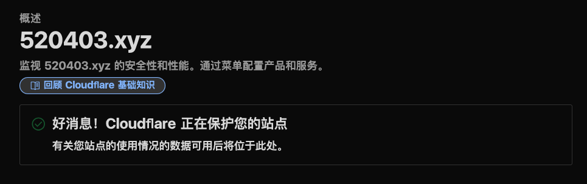

## 我为什么选择.xyz ##

我最开始使用的是DigitalPlat的免费二级域名（.dpdns.org, .qqz.io），但是有一些小问题让我放弃了免费的方案，而使用了现在用的.xyz的域名。

1. 免费域名的问题
    - 在使用免费域名的时候会出现解析到127.0.0.1的情况
    - 这免费域名vercel它不认啊
    - 免费域名经过我尝试，只能使用cloudflare进行管理
2. 纯数字的.xyz太便宜了，10年时间只要50块人民币

## 如何购买 ##

6位数字+.xyz域名我是在[spaceship](https://www.spaceship.com)去购买的，而且spaceship支持国内的支付宝进行支付。虽然说去阿里云买也很便宜，大概10年70多块，缺点就是要备案

## 域名托管 ##

spaceship自带dns服务，但是国内访问有点慢，所以还是使用赛博活佛cloudflare进行域名托管，当然，也可以使用像dnspod，阿里云这种服务商，然后就是改一下ns地址，等一会就可以用cloudflare进行域名解析了

