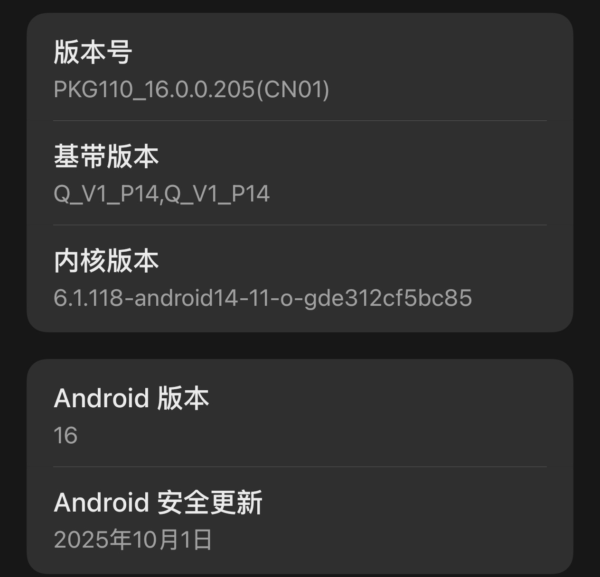
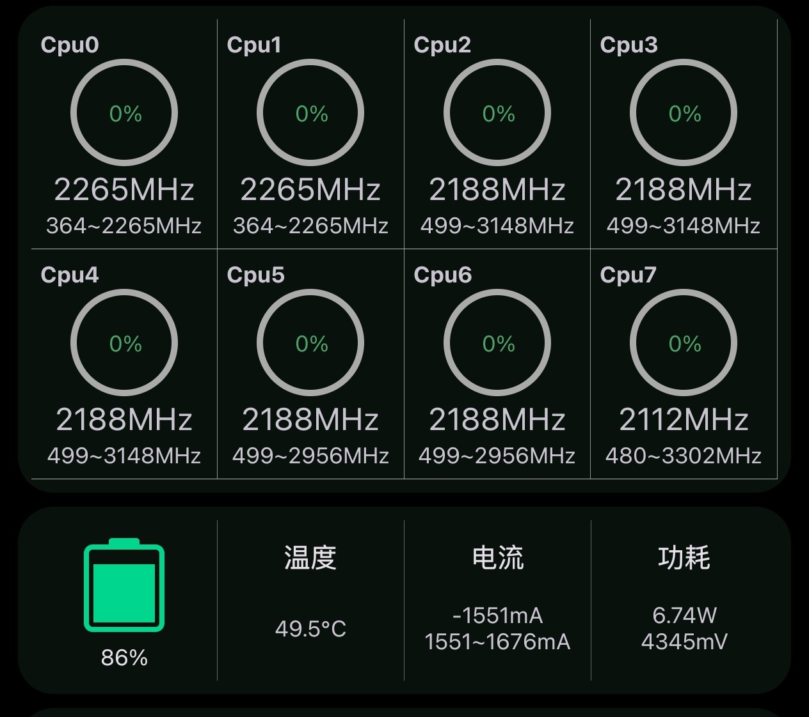
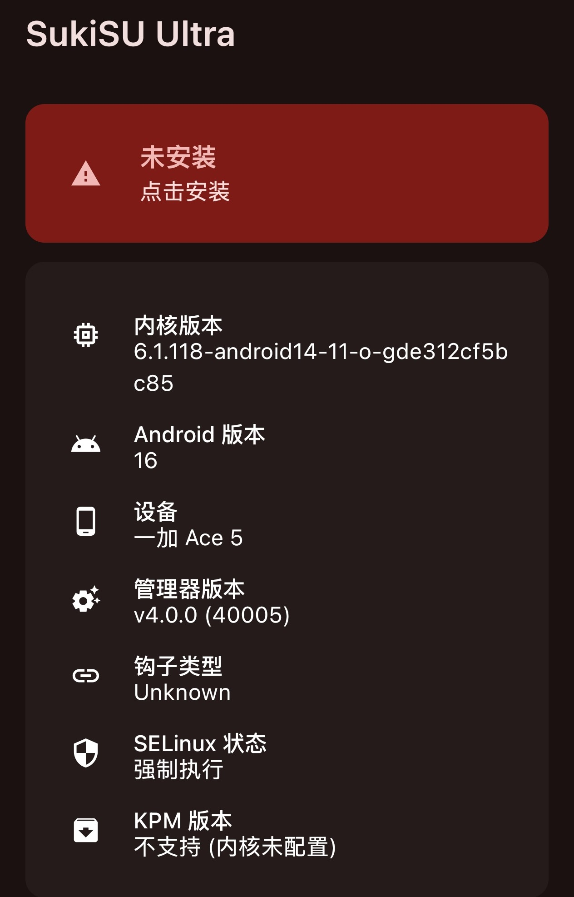

# 升级colorOS16后的问题

## 事发之前

本人在酷安里找到了本机的完整包，所以就按照正常OTA的更新方式更新了

- 下好后用luckytools本地安装
- 然后在ssu的管理器里安装到未使用的槽位
- **重启**

## 出事时

可以看到Soc占用异常，并且我的root掉了

## 解决方法

我在[github issues](https://github.com/SukiSU-Ultra/SukiSU-Ultra/issues/510)  看到了解决方法

- 先重新安装ssu管理器（40100）进行修补`init_boot`并重新刷入
- 再把`/data/adb/ksud`文件删除就好了，但是如何在没有root的情况下，没办法在系统进行删除，所以用`twrp`进行删除，
- 用`fastboot flash recovery_(你的槽位) （你的rec）`进行刷入，然后重启到twrp进行删除

## 完成

