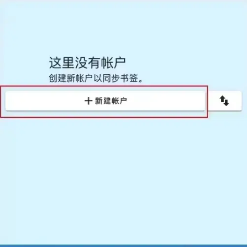
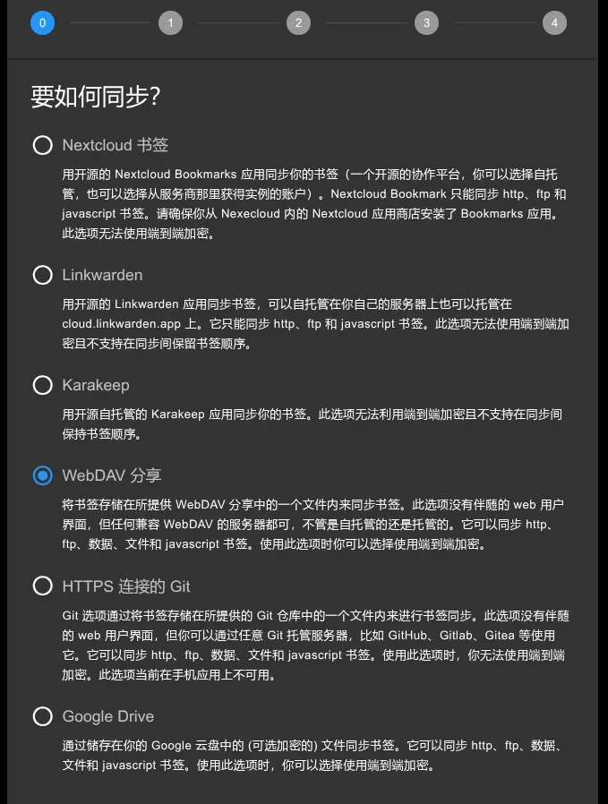
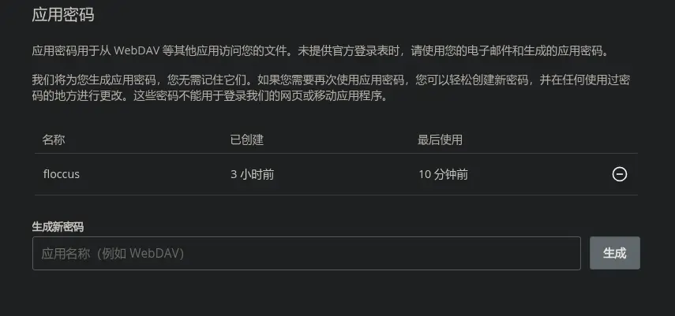
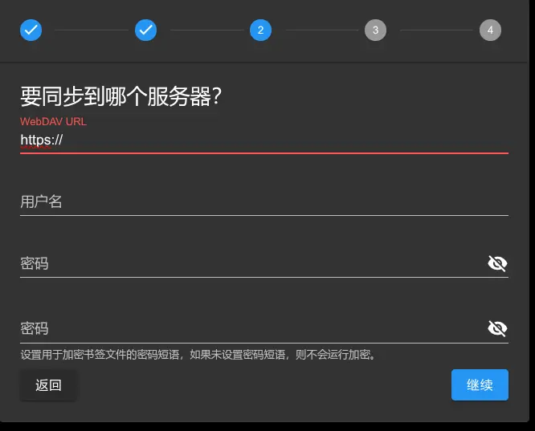
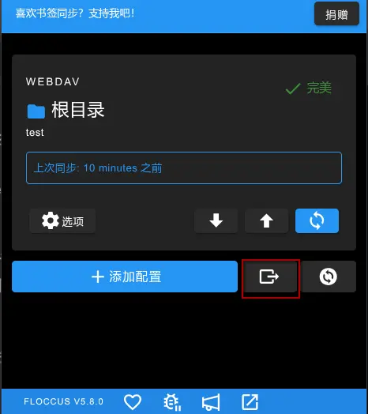
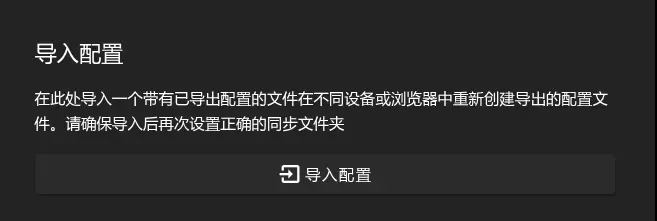

# 如何在不同的浏览器里同步书签

## 安装

- 在[fluccos官网](https://floccus.org/)下载插件，支持Chrome，Firefox等

## 配置

- 打开扩展

- 使用`WebDav`的方式

 

> 简单来说，webdav就像一个存储服务，各种应用都可以连接到它，允许应用直接访问我们的云盘内容，对其进行读写操作。我们可以网络服务比作一只章鱼，云盘是它的大脑，WebDAV是它的触角。每个触角都连接到我们智能设备上的应用程序。我们的应用可以通过触角读取章鱼的大脑，并将数据写入大脑，改变大脑的记忆和内容。

### 如何配置WebDAV

本人使用的是Koofr + Onedrive 的方式

- 打开[Koofr](https://app.koofr.net/)，用邮箱注册一个账号，登入后，链接一下Onedrive， 接着点右上方的的头像，在首选项里点开密码，生成一个新的应用密码，并复制下来，最后你会得到下图。

### 配置扩展
- 

| 名称 | 信息 |
|---|---|
| WebDAV Url | <https://app.koofr.net/dav/OneDrive> |
| 用户名 | `你的邮箱` |
| 密码 | `刚刚复制的应用密码` |

- 配置完成后记得保存

### 在其他浏览器同步

- 点击导出

- 在其他浏览器安装好扩展后，添加配置时，选择刚才的文件导入配置

**现在，你就可以在不同的浏览器里同步书签了**
