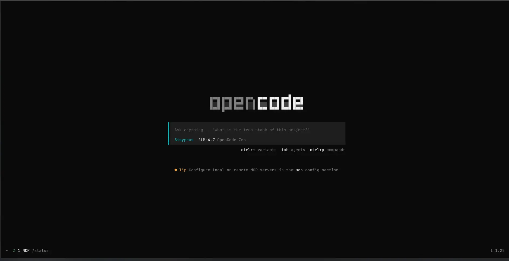

# 什么是OpenCode

简单来说，OpenCode 就是一个 “免费、开源、能帮你写代码的 AI 助手”，但它跟 ChatGPT 网页版或者 Cursor 这种编辑器不太一样，它更像是一个能直接接管你电脑终端（命令行）的超级管家。
为了让你秒懂，我们可以把它比作 **“AI 版的瑞士军刀”**，

1. **它主要在终端里干活**
    它的核心界面不是Currsor那种漂亮的IDE，而是终端（Terminal）。在命令行里输入 opencode 启动它。
2. **它有两个模式**
    Build 模式（干活模式）：它拥有最高权限，可以新建文件、运行命令、修改代码。适合让它帮你写新功能。
Plan 模式（参谋模式）：它只能看，不能改。适合你给它一个陌生的烂代码库，让它告诉你 “这坨代码是干嘛的”、“哪里有问题”，不用担心它手滑把代码改错了。
1. 它是免费的（开源）
它有GML-4.7, Big Pickle, Grok Code Fast 1, MiniMax M2.1的免费模型足够让新手使用ai来进行编程了

# 安装

根据[OpenCode](https://opencode.ai/)官方说明进行安装.
比如Windows在powershell里输入`curl -fsSL https://opencode.ai/install | bash`然后有一个良好的网络环境,就可以等待进度条跑完自动安装了.

> Tips:
> 如果你用的是Arch系的linux,你可以在终端输入`paru -S opencode-bin`或者`yay -S opencode-bin`就可以用别人打包好的opencode了

在终端里输入`opencode`
此时你会得到下图



**注意**:如果你要在vscode里使用opencode,不仅要安装插件还要安装命令行版本的opencode

这时你的opencode应该就是可用状态了

# 使用Google genmin

用[opencode-antigravity-auth](https://github.com/NoeFabris/opencode-antigravity-auth)这个项目

在打开的opencode命令行里输入

```
Install the opencode-antigravity-auth plugin and add the Antigravity model definitions to ~/.config/opencode/opencode.json by following: https://raw.githubusercontent.com/NoeFabris/opencode-antigravity-auth/dev/README.md
```
剩下的ai会帮你自动弄好
然后按照它的说明,登入你的google账号,你就有白嫖的google genmin了

然后可以愉快的使用谷歌genmin了

目前谷歌封号严重,谨慎使用,非antigravity客户端有封号风险